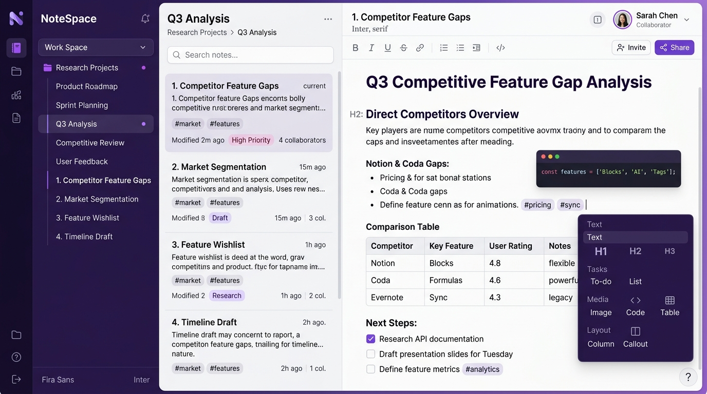
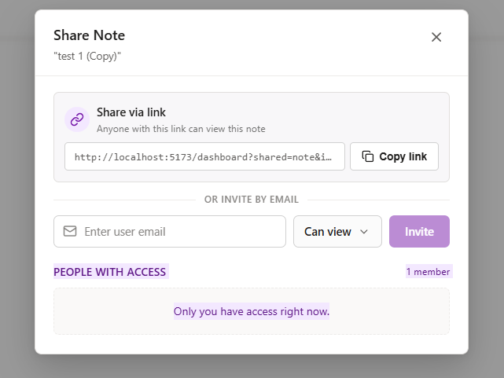
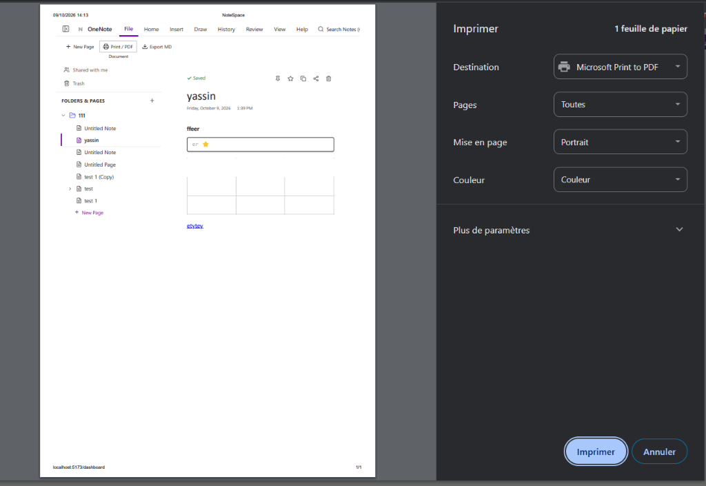
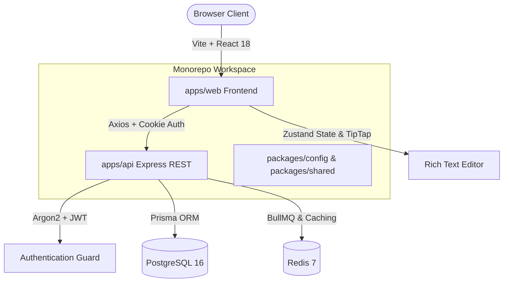

<div align="center">

# 📝 NoteSpace

**A Next-Generation, Collaborative Workspace & Note-Taking Application**

*Inspired by Microsoft OneNote’s hierarchical depth and Notion’s fluid modern editing experience.*

[](https://www.typescriptlang.org/)
[](https://reactjs.org/)
[](https://vitejs.dev/)
[](https://nodejs.org/)
[](https://expressjs.com/)
[](https://www.postgresql.org/)
[](https://www.prisma.io/)
[](./LICENSE)

<br />

<p align="center">
  
</p>

</div>

---

## 🌟 Overview

**NoteSpace** is an enterprise-grade, full-stack note-taking and knowledge-base platform crafted for individuals, students, developers, and teams who demand both structured hierarchy and distraction-free editing.

Traditional note apps often force a tradeoff between rigid legacy software and cluttered infinite-canvas apps. **NoteSpace delivers the best of both worlds**:
- **Microsoft OneNote's proven architecture**: Multi-tier organization (**Notebooks ➔ Sections ➔ Notes**).
- **Notion-like modern editing power**: Slash commands (`/`), formatted tables, code blocks with syntax highlighting, checklists, and tags.
- **Privacy & Ownership**: Built on a modern open-architecture monorepo with PostgreSQL and Docker.

---

## ✨ Key Features

### 📚 1. Three-Tier Hierarchical Structure
Never lose track of your thoughts. Organize your knowledge naturally:
* **Notebooks**: High-level workspaces (e.g., *Engineering*, *Personal*, *Client Projects*).
* **Sections**: Categorized topic dividers with distinct color badges.
* **Pages & Subpages**: Individual notes with instant search, pinned favorites, and tags.

### ✍️ 2. Rich-Text Editor & Slash Command Menu
Powered by TipTap and Prosemirror, the editor gives you full typography control:
* **Keyboard-first Slash (`/`) Commands**: Type `/` anywhere to insert headings, tables, task lists, code snippets, or blockquotes instantly.
* **Interactive Data Tables**: Add rows, columns, and format table headers effortlessly.
* **Developer-Friendly Code Blocks**: Embedded code snippets with language syntax highlighting.
* **Interactive Checklists**: Real-time todo items with completion tracking.

### 🤝 3. Real-Time Sharing & Granular Permissions
Collaborate seamlessly with teammates and study partners without losing access control:

<p align="center">
  
</p>

* **Shareable Links**: Generate instant access URLs with granular view or edit permissions.
* **Email Invitations**: Invite collaborators directly with role-based access control (**Owner**, **Editor**, **Viewer**).
* **Owner Badges & Team Roster**: Transparent permission inspection showing who has access.
* **"Add to My Files" Banner**: Shared recipients can seamlessly clone or save notes directly into their personal notebook tree.

### 🖨️ 4. Universal Export & Printing
Your notes are never locked into a walled garden:

<p align="center">
  
</p>

* **Print & PDF Engine**: Pixel-perfect print stylesheets that isolate the note content for clean printing and PDF export.
* **Markdown (`.md`) Export**: Export notes to clean, formatted Markdown for your GitHub repositories or Obsidian vaults.
* **HTML & Plain Text**: Instant download in standards-compliant HTML or raw text formats.

### ⚡ 5. Real-Time Autosave & State Resilience
* **Zero-Friction Autosave**: Debounced background persistence ensures not a single keystroke is lost.
* **Optimistic UI Updates**: Instant local feedback backed by asynchronous synchronization with PostgreSQL.
* **Soft Deletes & Recycle Bin**: Safely move items to trash with one-click restore or permanent wipe.

---

## 🛠️ Architecture & Technology Stack

NoteSpace is architected as a high-performance **Turborepo** monorepo designed for scale:



| Layer | Technologies Used | Description |
| :--- | :--- | :--- |
| **Frontend** | React 18, Vite, TypeScript, TailwindCSS/Vanilla CSS | Fast SPA with sub-second HMR and minimal bundle footprint |
| **State & Store** | Zustand, TanStack Query | Reactive client cache with optimistic updates |
| **Editor Core** | TipTap, ProseMirror | Extensible schema-based document and block model |
| **Backend API** | Node.js 20, Express, TypeScript | Type-safe REST API with layered service & controller architecture |
| **Database & ORM** | PostgreSQL 16, Prisma ORM | Relational schema with JSONB document storage & full-text search |
| **Security** | Argon2, JWT (HttpOnly Cookies), Helmet, Rate Limiter | Defense-in-depth protection against XSS, CSRF, and brute force |
| **Infrastructure** | Docker, Docker Compose, Turborepo | Reproducible containerized environments for dev and production |

---

## 🚀 Quick Start Guide

### Prerequisites
- **Node.js**: `v20.x` or higher
- **npm**: `v10.x` or higher
- **Docker Desktop**: For running the PostgreSQL and Redis services

### 1. Clone the Repository
```bash
git clone https://github.com/Houssam-C-H/note-app.git
cd note-app
```

### 2. Install Dependencies
```bash
npm install
```

### 3. Spin Up Infrastructure
Start the PostgreSQL database via Docker:
```bash
docker-compose up -d db
```

### 4. Setup Environment Variables
Copy the example environment configurations:
```bash
cp apps/api/.env.example apps/api/.env
cp apps/web/.env.example apps/web/.env
```

Apply database migrations:
```bash
cd apps/api
npx prisma db push
cd ../..
```

### 5. Start the Development Servers
Run both the frontend (`apps/web`) and backend API (`apps/api`) concurrently:
```bash
npm run dev
```

The application will be live at:
* **Frontend Web App**: [http://localhost:5173](http://localhost:5173)
* **Backend API Server**: [http://localhost:3000/api](http://localhost:3000/api)

---

## 📁 Repository Structure

```
note-app/
├── apps/
│   ├── web/                     # Vite + React 18 Frontend
│   │   ├── src/
│   │   │   ├── components/      # UI Components (NoteEditor, RibbonToolbar, ShareDialog, etc.)
│   │   │   ├── store/           # Zustand State Management (noteStore, authStore)
│   │   │   ├── hooks/           # Custom React Hooks
│   │   │   └── utils/           # Utilities (exportUtils, formatting)
│   ├── api/                     # Node.js + Express Backend
│   │   ├── src/
│   │   │   ├── controllers/     # REST Endpoints (auth, note, notebook, share)
│   │   │   ├── services/        # Business Logic & Validation
│   │   │   └── lib/             # Prisma client & utility singletons
│   │   └── prisma/              # Schema definitions and migrations
├── docs/                        # In-depth architectural specifications
│   ├── ARCHITECTURE.md          # System design & component boundaries
│   ├── FRONTEND.md              # Client patterns, UI/UX architecture
│   ├── BACKEND.md               # API design & service layer
│   ├── DATABASE.md              # Schema, relational ERD, and indexing
│   ├── SECURITY.md              # Auth tokens, hashing, sanitization
│   └── images/                  # Project screenshots & assets
├── packages/                    # Shared monorepo packages
└── turbo.json                   # Turborepo build pipeline configuration
```

---

## 📖 Deep-Dive Documentation

Explore our comprehensive technical blueprints in the [`docs/`](./docs) folder:

- [ARCHITECTURE.md](docs/ARCHITECTURE.md) — High-level architecture, caching, and data pipelines
- [FRONTEND.md](docs/FRONTEND.md) — Component hierarchy, CSS styling tokens, and TipTap schema
- [BACKEND.md](docs/BACKEND.md) — REST endpoints, rate limiting, and middleware
- [DATABASE.md](docs/DATABASE.md) — Schema design, foreign keys, and full-text search indexing
- [AUTHENTICATION.md](docs/AUTHENTICATION.md) — JWT lifecycle, Argon2 hashing, and refresh tokens
- [SECURITY.md](docs/SECURITY.md) — OWASP safeguards, CSRF prevention, and Content Security Policy
- [DEPLOYMENT.md](docs/DEPLOYMENT.md) — Production Docker orchestration and Nginx reverse proxy

---

## ⚖️ License & Commercial Restrictions

This project is licensed under a custom **Source-Available Non-Commercial License**. See the full [`LICENSE`](./LICENSE) file for exact terms.

* **✅ Free for Individuals & Non-Commercial Use:** Free for students, educators, developers, hobbyists, and non-profit organizations to inspect, compile, customize, and self-host for personal productivity.
* **🚫 Commercial Use Prohibited:** Any use by commercial enterprises, for-profit businesses, or integration into paid services/SaaS platforms is strictly prohibited without an explicit commercial license.

> **💼 Inquiring About a Commercial or Enterprise License?**  
> If your organization wants to deploy NoteSpace internally or license the source code for commercial distribution, please contact the author or open an inquiry.

---

<div align="center">
  <sub>Built with ❤️ by Houssam C.H. and NoteSpace Contributors.</sub>
</div>
