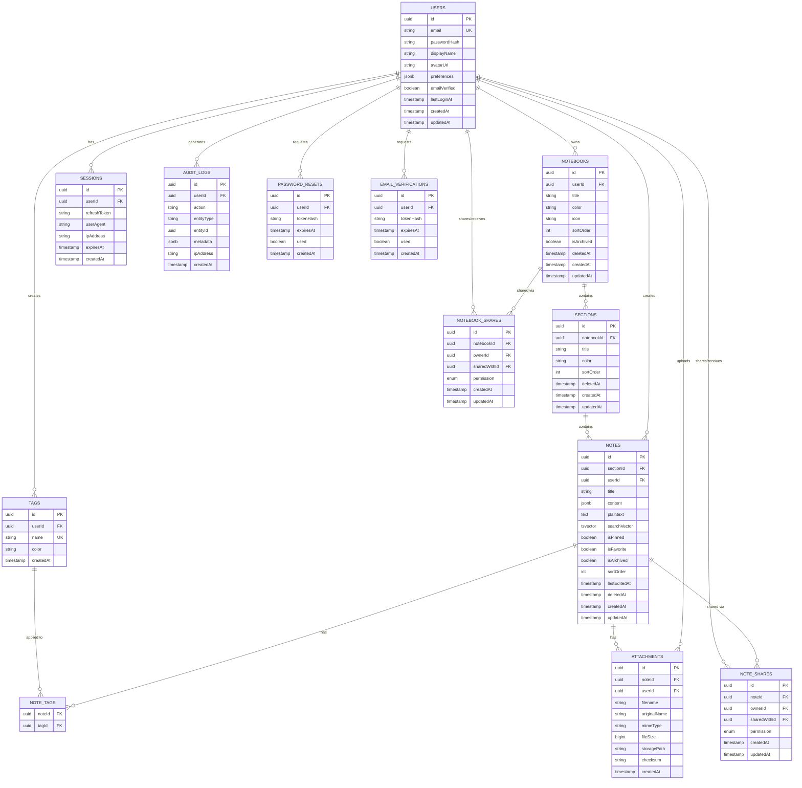

# Database Design — NoteSpace

---

## 1. Database Engine

**PostgreSQL 16** — chosen for relational integrity, JSONB support, full-text search, and Prisma compatibility.

---

## 2. Schema Design Principles

- **UUID v4 primary keys** — prevents enumeration attacks, safe for URLs.
- **Soft deletes** — `deletedAt` timestamp on restorable entities (notes, notebooks, sections).
- **Timestamps** — `createdAt` and `updatedAt` on every table.
- **Foreign key constraints** — referential integrity enforced at the database level.
- **Indexes** — on all foreign keys, search columns, and frequently filtered columns.
- **JSONB** — for rich-text content storage (TipTap/ProseMirror JSON).

---

## 3. Entity-Relationship Diagram



---

## 4. Table Definitions

### 4.1 `users`

| Column          | Type        | Constraints                    | Description                         |
|-----------------|-------------|--------------------------------|-------------------------------------|
| `id`            | UUID        | PK, DEFAULT gen_random_uuid()  | Unique user identifier              |
| `email`         | VARCHAR(255)| UNIQUE, NOT NULL               | Login email, normalized lowercase   |
| `passwordHash`  | VARCHAR(255)| NOT NULL                       | Argon2id hash                       |
| `displayName`   | VARCHAR(100)| NOT NULL                       | User's display name                 |
| `avatarUrl`     | VARCHAR(500)| NULLABLE                       | Profile image URL/path              |
| `preferences`   | JSONB       | DEFAULT '{}'                   | UI preferences (theme, language)    |
| `emailVerified` | BOOLEAN     | DEFAULT false                  | Email verification status           |
| `lastLoginAt`   | TIMESTAMPTZ | NULLABLE                       | Last successful login               |
| `createdAt`     | TIMESTAMPTZ | DEFAULT NOW()                  | Account creation time               |
| `updatedAt`     | TIMESTAMPTZ | DEFAULT NOW()                  | Last profile update                 |

**Indexes**: `UNIQUE(email)`, `idx_users_created_at`

---

### 4.2 `notebooks`

| Column          | Type        | Constraints                    | Description                         |
|-----------------|-------------|--------------------------------|-------------------------------------|
| `id`            | UUID        | PK, DEFAULT gen_random_uuid()  | Unique notebook identifier          |
| `userId`        | UUID        | FK → users(id), NOT NULL       | Owner                               |
| `title`         | VARCHAR(200)| NOT NULL                       | Notebook name                       |
| `color`         | VARCHAR(7)  | DEFAULT '#6366f1'              | Hex color for UI                    |
| `icon`          | VARCHAR(50) | DEFAULT 'notebook'             | Icon identifier                     |
| `sortOrder`     | INTEGER     | DEFAULT 0                      | User-defined ordering               |
| `isArchived`    | BOOLEAN     | DEFAULT false                  | Archived status                     |
| `deletedAt`     | TIMESTAMPTZ | NULLABLE                       | Soft delete timestamp               |
| `createdAt`     | TIMESTAMPTZ | DEFAULT NOW()                  | Creation time                       |
| `updatedAt`     | TIMESTAMPTZ | DEFAULT NOW()                  | Last update                         |

**Indexes**: `idx_notebooks_user_id`, `idx_notebooks_deleted_at`
**Constraints**: `CHECK(title <> '')`

---

### 4.3 `sections`

| Column          | Type        | Constraints                    | Description                         |
|-----------------|-------------|--------------------------------|-------------------------------------|
| `id`            | UUID        | PK, DEFAULT gen_random_uuid()  | Unique section identifier           |
| `notebookId`    | UUID        | FK → notebooks(id), NOT NULL   | Parent notebook                     |
| `title`         | VARCHAR(200)| NOT NULL                       | Section name                        |
| `color`         | VARCHAR(7)  | DEFAULT '#8b5cf6'              | Hex color for UI tab                |
| `sortOrder`     | INTEGER     | DEFAULT 0                      | User-defined ordering               |
| `deletedAt`     | TIMESTAMPTZ | NULLABLE                       | Soft delete timestamp               |
| `createdAt`     | TIMESTAMPTZ | DEFAULT NOW()                  | Creation time                       |
| `updatedAt`     | TIMESTAMPTZ | DEFAULT NOW()                  | Last update                         |

**Indexes**: `idx_sections_notebook_id`, `idx_sections_deleted_at`
**Constraints**: `CHECK(title <> '')`

---

### 4.4 `notes`

| Column          | Type        | Constraints                    | Description                         |
|-----------------|-------------|--------------------------------|-------------------------------------|
| `id`            | UUID        | PK, DEFAULT gen_random_uuid()  | Unique note identifier              |
| `sectionId`     | UUID        | FK → sections(id), NOT NULL    | Parent section                      |
| `userId`        | UUID        | FK → users(id), NOT NULL       | Author/owner                        |
| `title`         | VARCHAR(500)| NOT NULL, DEFAULT 'Untitled'   | Note title                          |
| `content`       | JSONB       | DEFAULT '{}'                   | TipTap/ProseMirror JSON document    |
| `plaintext`     | TEXT        | DEFAULT ''                     | Extracted plaintext for search      |
| `searchVector`  | TSVECTOR    | GENERATED                      | Full-text search vector             |
| `isPinned`      | BOOLEAN     | DEFAULT false                  | Pinned to top                       |
| `isFavorite`    | BOOLEAN     | DEFAULT false                  | Favorited                           |
| `isArchived`    | BOOLEAN     | DEFAULT false                  | Archived                            |
| `sortOrder`     | INTEGER     | DEFAULT 0                      | User-defined ordering               |
| `lastEditedAt`  | TIMESTAMPTZ | DEFAULT NOW()                  | Last content edit                   |
| `deletedAt`     | TIMESTAMPTZ | NULLABLE                       | Soft delete (trash)                 |
| `createdAt`     | TIMESTAMPTZ | DEFAULT NOW()                  | Creation time                       |
| `updatedAt`     | TIMESTAMPTZ | DEFAULT NOW()                  | Last metadata update                |

**Indexes**:
- `idx_notes_section_id`
- `idx_notes_user_id`
- `idx_notes_deleted_at`
- `idx_notes_is_pinned`
- `idx_notes_is_favorite`
- `idx_notes_search_vector` (GIN)
- `idx_notes_last_edited_at`

**Search vector trigger**: Auto-updated on INSERT/UPDATE from `title` and `plaintext` columns.

```sql
CREATE INDEX idx_notes_search_vector ON notes USING GIN(searchVector);

CREATE FUNCTION notes_search_vector_update() RETURNS trigger AS $$
BEGIN
  NEW."searchVector" :=
    setweight(to_tsvector('english', coalesce(NEW.title, '')), 'A') ||
    setweight(to_tsvector('english', coalesce(NEW.plaintext, '')), 'B');
  RETURN NEW;
END;
$$ LANGUAGE plpgsql;

CREATE TRIGGER notes_search_vector_trigger
  BEFORE INSERT OR UPDATE OF title, plaintext ON notes
  FOR EACH ROW EXECUTE FUNCTION notes_search_vector_update();
```

---

### 4.5 `tags`

| Column          | Type        | Constraints                    | Description                         |
|-----------------|-------------|--------------------------------|-------------------------------------|
| `id`            | UUID        | PK, DEFAULT gen_random_uuid()  | Unique tag identifier               |
| `userId`        | UUID        | FK → users(id), NOT NULL       | Tag owner                           |
| `name`          | VARCHAR(50) | NOT NULL                       | Tag name                            |
| `color`         | VARCHAR(7)  | DEFAULT '#10b981'              | Tag color                           |
| `createdAt`     | TIMESTAMPTZ | DEFAULT NOW()                  | Creation time                       |

**Indexes**: `UNIQUE(userId, name)`
**Constraints**: `CHECK(name <> '')`

---

### 4.6 `note_tags` (Junction Table)

| Column   | Type | Constraints                             | Description      |
|----------|------|-----------------------------------------|------------------|
| `noteId` | UUID | FK → notes(id) ON DELETE CASCADE        | Note reference   |
| `tagId`  | UUID | FK → tags(id) ON DELETE CASCADE         | Tag reference    |

**Primary Key**: `(noteId, tagId)` — composite
**Indexes**: `idx_note_tags_tag_id`

---

### 4.7 `attachments`

| Column          | Type        | Constraints                    | Description                         |
|-----------------|-------------|--------------------------------|-------------------------------------|
| `id`            | UUID        | PK, DEFAULT gen_random_uuid()  | Unique attachment identifier        |
| `noteId`        | UUID        | FK → notes(id), NOT NULL       | Parent note                         |
| `userId`        | UUID        | FK → users(id), NOT NULL       | Uploader                            |
| `filename`      | VARCHAR(255)| NOT NULL                       | Stored filename (UUID-based)        |
| `originalName`  | VARCHAR(255)| NOT NULL                       | Original upload filename            |
| `mimeType`      | VARCHAR(100)| NOT NULL                       | MIME type                           |
| `fileSize`      | BIGINT      | NOT NULL                       | Size in bytes                       |
| `storagePath`   | VARCHAR(500)| NOT NULL                       | Path in storage backend             |
| `checksum`      | VARCHAR(64) | NOT NULL                       | SHA-256 hash for integrity          |
| `createdAt`     | TIMESTAMPTZ | DEFAULT NOW()                  | Upload time                         |

**Indexes**: `idx_attachments_note_id`, `idx_attachments_user_id`
**Constraints**: `CHECK(fileSize > 0)`, `CHECK(fileSize <= 26214400)` (25MB limit)

---

### 4.8 `note_shares`

| Column          | Type        | Constraints                    | Description                         |
|-----------------|-------------|--------------------------------|-------------------------------------|
| `id`            | UUID        | PK, DEFAULT gen_random_uuid()  | Unique share identifier             |
| `noteId`        | UUID        | FK → notes(id), NOT NULL       | Shared note                         |
| `ownerId`       | UUID        | FK → users(id), NOT NULL       | Note owner                          |
| `sharedWithId`  | UUID        | FK → users(id), NOT NULL       | Recipient                           |
| `permission`    | ENUM        | 'READ' or 'EDIT', NOT NULL     | Permission level                    |
| `createdAt`     | TIMESTAMPTZ | DEFAULT NOW()                  | Share creation time                 |
| `updatedAt`     | TIMESTAMPTZ | DEFAULT NOW()                  | Last permission update              |

**Indexes**: `UNIQUE(noteId, sharedWithId)`, `idx_note_shares_shared_with_id`

---

### 4.9 `notebook_shares`

| Column          | Type        | Constraints                    | Description                         |
|-----------------|-------------|--------------------------------|-------------------------------------|
| `id`            | UUID        | PK, DEFAULT gen_random_uuid()  | Unique share identifier             |
| `notebookId`    | UUID        | FK → notebooks(id), NOT NULL   | Shared notebook                     |
| `ownerId`       | UUID        | FK → users(id), NOT NULL       | Notebook owner                      |
| `sharedWithId`  | UUID        | FK → users(id), NOT NULL       | Recipient                           |
| `permission`    | ENUM        | 'READ' or 'EDIT', NOT NULL     | Permission level                    |
| `createdAt`     | TIMESTAMPTZ | DEFAULT NOW()                  | Share creation time                 |
| `updatedAt`     | TIMESTAMPTZ | DEFAULT NOW()                  | Last permission update              |

**Indexes**: `UNIQUE(notebookId, sharedWithId)`, `idx_notebook_shares_shared_with_id`

---

### 4.10 `sessions`

| Column          | Type        | Constraints                    | Description                         |
|-----------------|-------------|--------------------------------|-------------------------------------|
| `id`            | UUID        | PK, DEFAULT gen_random_uuid()  | Session identifier                  |
| `userId`        | UUID        | FK → users(id), NOT NULL       | Session owner                       |
| `refreshToken`  | VARCHAR(500)| NOT NULL                       | Hashed refresh token                |
| `userAgent`     | VARCHAR(500)| NULLABLE                       | Client user agent string            |
| `ipAddress`     | VARCHAR(45) | NULLABLE                       | Client IP (IPv4 or IPv6)            |
| `expiresAt`     | TIMESTAMPTZ | NOT NULL                       | Token expiration                    |
| `createdAt`     | TIMESTAMPTZ | DEFAULT NOW()                  | Session creation                    |

**Indexes**: `idx_sessions_user_id`, `idx_sessions_expires_at`

---

### 4.11 `audit_logs`

| Column          | Type        | Constraints                    | Description                         |
|-----------------|-------------|--------------------------------|-------------------------------------|
| `id`            | UUID        | PK, DEFAULT gen_random_uuid()  | Log entry identifier                |
| `userId`        | UUID        | FK → users(id), NULLABLE       | Acting user (null for system)       |
| `action`        | VARCHAR(50) | NOT NULL                       | Action performed                    |
| `entityType`    | VARCHAR(50) | NOT NULL                       | Entity type (note, notebook, etc.)  |
| `entityId`      | UUID        | NULLABLE                       | Affected entity                     |
| `metadata`      | JSONB       | DEFAULT '{}'                   | Additional context                  |
| `ipAddress`     | VARCHAR(45) | NULLABLE                       | Client IP                           |
| `createdAt`     | TIMESTAMPTZ | DEFAULT NOW()                  | Event time                          |

**Indexes**: `idx_audit_logs_user_id`, `idx_audit_logs_entity`, `idx_audit_logs_created_at`
**Note**: This table is append-only. No updates or deletes.

---

### 4.12 `password_resets`

| Column          | Type        | Constraints                    | Description                         |
|-----------------|-------------|--------------------------------|-------------------------------------|
| `id`            | UUID        | PK, DEFAULT gen_random_uuid()  | Reset request identifier            |
| `userId`        | UUID        | FK → users(id), NOT NULL       | User requesting reset               |
| `tokenHash`     | VARCHAR(255)| NOT NULL                       | SHA-256 hash of reset token         |
| `expiresAt`     | TIMESTAMPTZ | NOT NULL                       | Token expiration (1 hour)           |
| `used`          | BOOLEAN     | DEFAULT false                  | Whether token was consumed          |
| `createdAt`     | TIMESTAMPTZ | DEFAULT NOW()                  | Request time                        |

**Indexes**: `idx_password_resets_token_hash`, `idx_password_resets_user_id`

---

### 4.13 `email_verifications`

| Column          | Type        | Constraints                    | Description                         |
|-----------------|-------------|--------------------------------|-------------------------------------|
| `id`            | UUID        | PK, DEFAULT gen_random_uuid()  | Verification identifier             |
| `userId`        | UUID        | FK → users(id), NOT NULL       | User to verify                      |
| `tokenHash`     | VARCHAR(255)| NOT NULL                       | SHA-256 hash of verification token  |
| `expiresAt`     | TIMESTAMPTZ | NOT NULL                       | Token expiration (24 hours)         |
| `used`          | BOOLEAN     | DEFAULT false                  | Whether token was consumed          |
| `createdAt`     | TIMESTAMPTZ | DEFAULT NOW()                  | Request time                        |

**Indexes**: `idx_email_verifications_token_hash`, `idx_email_verifications_user_id`

---

## 5. Migration Strategy

- **Tool**: Prisma Migrate
- **Approach**: Schema-first — define `schema.prisma`, Prisma generates SQL migrations.
- **Naming**: Timestamped migration directories (auto-generated by Prisma).
- **Environments**:
  - `dev`: `prisma migrate dev` — creates and applies migrations.
  - `prod`: `prisma migrate deploy` — applies pending migrations only.
- **Rollback**: Manual SQL scripts for critical rollbacks (Prisma does not auto-rollback).
- **Seed**: `prisma db seed` — creates test data in development.

---

## 6. Performance Considerations

| Concern                  | Strategy                                               |
|--------------------------|--------------------------------------------------------|
| Full-text search         | GIN index on `searchVector` tsvector column            |
| Note listing             | Composite index on `(sectionId, deletedAt, sortOrder)` |
| Favorites/Pinned         | Partial indexes: `WHERE isPinned = true`               |
| Pagination               | Cursor-based using `id` + `createdAt`                  |
| Connection pooling       | Prisma pool + PgBouncer in production                  |
| Large content            | JSONB stored inline; consider TOAST compression        |
| Orphaned attachments     | Background job scans for unreferenced files             |
